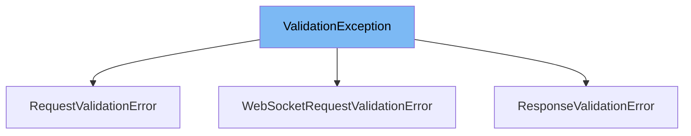

This document will cover the `ValidationException` class in the FastAPI framework. We'll cover:

1. What is `ValidationException`
2. Variables and functions in `ValidationException`
3. Usage example of `ValidationException`



# What is ValidationException

`ValidationException` is a custom exception class in FastAPI. It is used to handle validation errors that occur when processing request data. This class is a part of FastAPI's error handling system, which provides clear and precise error messages.

<SwmSnippet path="/fastapi/exceptions.py" line="150">

---

# Variables and functions

The `__init__` function is the constructor for the `ValidationException` class. It takes a sequence of errors as an argument and assigns it to the `_errors` instance variable.

```python
    def __init__(self, errors: Sequence[Any]) -> None:
        self._errors = errors
```

---

</SwmSnippet>

<SwmSnippet path="/fastapi/exceptions.py" line="153">

---

The `errors` function is a getter method that returns the `_errors` instance variable. This method is used to retrieve the sequence of errors that the `ValidationException` was initialized with.

```python
    def errors(self) -> Sequence[Any]:
        return self._errors
```

---

</SwmSnippet>

<SwmSnippet path="/fastapi/exceptions.py" line="167">

---

# Usage example

`ResponseValidationError` is a subclass of `ValidationException` that is used to handle validation errors in responses. It overrides the `__str__` method to provide a custom string representation of the validation errors.

```python
class ResponseValidationError(ValidationException):
    def __init__(self, errors: Sequence[Any], *, body: Any = None) -> None:
        super().__init__(errors)
        self.body = body

    def __str__(self) -> str:
        message = f"{len(self._errors)} validation errors:\n"
        for err in self._errors:
            message += f"  {err}\n"
        return message
```

---

</SwmSnippet>

&nbsp;

*This is an auto-generated document by Swimm AI 🌊 and has not yet been verified by a human*

<SwmMeta version="3.0.0" repo-id="Z2l0aHViJTNBJTNBREVNTy1mYXN0YXBpJTNBJTNBZ2lsYWRuYXZvdA==" repo-name="DEMO-fastapi" doc-type="general-class"><sup>Powered by [Swimm](/)</sup></SwmMeta>
