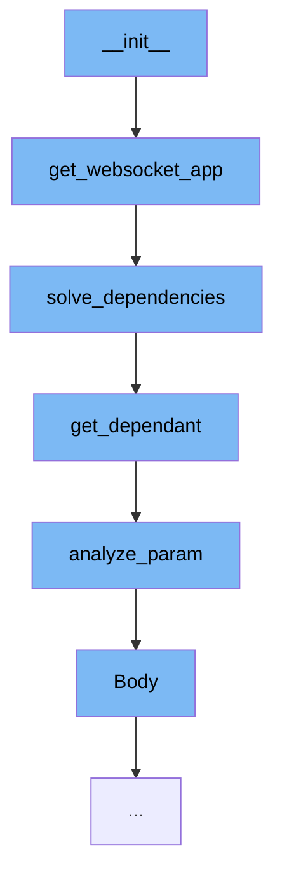

This document will cover the process of initializing a WebSocket application in FastAPI, which includes:

1. Constructing the WebSocket application
2. Solving dependencies
3. Getting dependant
4. Analyzing parameters
5. Body parameters



<SwmSnippet path="/fastapi/routing.py" line="329">

---

# Constructing the WebSocket application

The `get_websocket_app` function is used to construct a WebSocket application. It takes in a `Dependant` object and an optional `dependency_overrides_provider`. It then solves the dependencies and calls the dependant function with the solved values.

```python
def get_websocket_app(
    dependant: Dependant, dependency_overrides_provider: Optional[Any] = None
) -> Callable[[WebSocket], Coroutine[Any, Any, Any]]:
    async def app(websocket: WebSocket) -> None:
        async with AsyncExitStack() as async_exit_stack:
            # TODO: remove this scope later, after a few releases
            # This scope fastapi_astack is no longer used by FastAPI, kept for
            # compatibility, just in case
            websocket.scope["fastapi_astack"] = async_exit_stack
            solved_result = await solve_dependencies(
                request=websocket,
                dependant=dependant,
                dependency_overrides_provider=dependency_overrides_provider,
                async_exit_stack=async_exit_stack,
            )
            values, errors, _, _2, _3 = solved_result
            if errors:
                raise WebSocketRequestValidationError(_normalize_errors(errors))
            assert dependant.call is not None, "dependant.call must be a function"
            await dependant.call(**values)

```

---

</SwmSnippet>

<SwmSnippet path="/fastapi/dependencies/utils.py" line="524">

---

# Solving dependencies

The `solve_dependencies` function is used to solve the dependencies for a given `Dependant` object. It takes in a request, a dependant, and optional parameters for body, background tasks, response, dependency overrides provider, dependency cache, and async exit stack. It returns a tuple of values, errors, background tasks, response, and dependency cache.

```python
async def solve_dependencies(
    *,
    request: Union[Request, WebSocket],
    dependant: Dependant,
    body: Optional[Union[Dict[str, Any], FormData]] = None,
    background_tasks: Optional[StarletteBackgroundTasks] = None,
    response: Optional[Response] = None,
    dependency_overrides_provider: Optional[Any] = None,
    dependency_cache: Optional[Dict[Tuple[Callable[..., Any], Tuple[str]], Any]] = None,
    async_exit_stack: AsyncExitStack,
) -> Tuple[
    Dict[str, Any],
    List[Any],
    Optional[StarletteBackgroundTasks],
    Response,
    Dict[Tuple[Callable[..., Any], Tuple[str]], Any],
]:
    values: Dict[str, Any] = {}
    errors: List[Any] = []
    if response is None:
        response = Response()
```

---

</SwmSnippet>

<SwmSnippet path="/fastapi/dependencies/utils.py" line="241">

---

# Getting dependant

The `get_dependant` function is used to get a `Dependant` object for a given path and call. It takes in a path, a call, an optional name, security scopes, and a use cache flag. It returns a `Dependant` object.

```python
def get_dependant(
    *,
    path: str,
    call: Callable[..., Any],
    name: Optional[str] = None,
    security_scopes: Optional[List[str]] = None,
    use_cache: bool = True,
) -> Dependant:
    path_param_names = get_path_param_names(path)
    endpoint_signature = get_typed_signature(call)
    signature_params = endpoint_signature.parameters
    dependant = Dependant(
        call=call,
        name=name,
        path=path,
        security_scopes=security_scopes,
        use_cache=use_cache,
    )
    for param_name, param in signature_params.items():
        is_path_param = param_name in path_param_names
        type_annotation, depends, param_field = analyze_param(
```

---

</SwmSnippet>

<SwmSnippet path="/fastapi/dependencies/utils.py" line="317">

---

# Analyzing parameters

The `analyze_param` function is used to analyze a parameter. It takes in a parameter name, an annotation, a value, and a flag indicating if it is a path parameter. It returns a tuple of type annotation, depends, and field.

```python
def analyze_param(
    *,
    param_name: str,
    annotation: Any,
    value: Any,
    is_path_param: bool,
) -> Tuple[Any, Optional[params.Depends], Optional[ModelField]]:
    field_info = None
    depends = None
    type_annotation: Any = Any
    use_annotation: Any = Any
    if annotation is not inspect.Signature.empty:
        use_annotation = annotation
        type_annotation = annotation
    if get_origin(use_annotation) is Annotated:
        annotated_args = get_args(annotation)
        type_annotation = annotated_args[0]
        fastapi_annotations = [
            arg
            for arg in annotated_args[1:]
            if isinstance(arg, (FieldInfo, params.Depends))
```

---

</SwmSnippet>

<SwmSnippet path="/fastapi/param_functions.py" line="1263">

---

# Body parameters

The `Body` function is used to create a body parameter. It takes in a default value and a number of optional parameters for customization. It returns a `Body` object.

```python
def Body(  # noqa: N802
    default: Annotated[
        Any,
        Doc(
            """
            Default value if the parameter field is not set.
            """
        ),
    ] = Undefined,
    *,
    default_factory: Annotated[
        Union[Callable[[], Any], None],
        Doc(
            """
            A callable to generate the default value.

            This doesn't affect `Path` parameters as the value is always required.
            The parameter is available only for compatibility.
            """
        ),
    ] = _Unset,
```

---

</SwmSnippet>

&nbsp;

*This is an auto-generated document by Swimm AI 🌊 and has not yet been verified by a human*

<SwmMeta version="3.0.0" repo-id="Z2l0aHViJTNBJTNBREVNTy1mYXN0YXBpJTNBJTNBZ2lsYWRuYXZvdA==" repo-name="DEMO-fastapi" doc-type="flows"><sup>Powered by [Swimm](/)</sup></SwmMeta>
